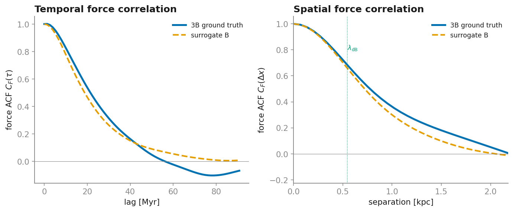

# Validation

All numbers below are for the shared benchmark halo $m_{22}=1$, $M_h=10^{10}\,M_\odot$, and are
reproduced by the scripts in [`benchmarks/`](https://github.com/sgpfaff/fdmforce/tree/master/benchmarks).

## Background

`benchmarks/` sanity values, all physically sensible across the target $(m,M_h)$ range:

| Quantity | Value |
|---|---|
| Virial velocity $V_{\rm vir}$ | 32.6 km/s (matches spherical collapse) |
| $M(<r_{\rm vir})/M_h$ | ≈ 1.1 (soliton adds ~10%) |
| $\lambda_{\rm dB}(r_s)$ | 0.55 kpc |
| Coherence time $\tau_{\rm coh}(r_s)$ | 0.0151 Gyr |

## 3B local GRF — `grf_check.py`

| Check | Result |
|---|---|
| $\langle\rho\rangle$ vs target | exact |
| Density PDF std/mean (expect 1 for $\lvert\text{GRF}\rvert^2$) | 1.014 |
| Granule size | 0.88 $\lambda_{\rm dB}$ |
| Poisson residual | $1.1\times10^{-13}$ |
| Coherence time | 0.0138 Gyr (0.92× predicted) |

## 3A eigenmode — `eigenmode_check.py`

2864 $(n,l)$ modes built in 2.5 s. The overlap-weighted beat spectrum at $r_s$ has median
61 Gyr⁻¹, so $1/\text{median} = 0.0163$ Gyr — **independently cross-validating** the granule
coherence time ($\tau_{\rm coh}=0.0151$ Gyr) obtained from 3B. The ensemble density profile is
currently ~2× (population/completeness/soliton handling deferred); 3A is used as an oracle, not
the production generator.

## Surrogate B — `surrogate_check.py`

Calibrated to 3B's force variance, the surrogate reproduces the correlation *shapes* from the
physics alone:

<figure markdown>
  
  <figcaption>The surrogate (dashed) reproduces both the temporal and spatial force
  autocorrelation of the local-GRF ground truth (solid) — calibrated only on the overall variance;
  the correlation <em>shapes</em> come from the physics.</figcaption>
</figure>

| Check | Result |
|---|---|
| $\langle\lvert F\rvert^2\rangle$ | matched (1-parameter calibration) |
| Spatial force ACF | corr length 0.87 vs 0.99 kpc, RMS 0.069 |
| Temporal force ACF | RMS 0.058 (after centering modes at $\omega=0$) |

## Velocity-diffusion coefficient — `diffusion_check.py`

The physical heating observable, $D=\langle\lvert F\rvert^2\rangle\int_0^\infty C_F(\tau)\,\mathrm d\tau$,
at $L_{\rm coh}=$ local scale height:

| $r$ (kpc) | $L_{\rm coh}/\lambda_{\rm dB}$ | $k_{\min}/k_\sigma$ | $D_{\rm sur}/D_{\rm 3B}$ |
|---|---|---|---|
| 22.2 | 8.9 | 0.70 | **0.86** |
| 44.4 | 14.0 | 0.45 | **0.76** |
| ≤ 11 | < 6 | > 1 | local approx breaks → soliton regime |

In its regime of validity the surrogate matches the diffusion coefficient to ~20% — well within
astrophysical uncertainty for heating rates — and self-identifies where the coherent-soliton
component must take over.

## C/OpenMP backend — `test_surrogate.py::test_c_matches_numpy`

| n_modes | numpy | C + OpenMP (15 cores) | speedup |
|---|---|---|---|
| 1024 | 540 ms/step | 30.8 ms | 17.5× |
| 2048 | 1120 ms/step | 78.6 ms | 14× |

The C backend matches numpy to $10^{-14}$. A 1 Gyr integration of 20k particles (M=1024) runs in
~30 s.
